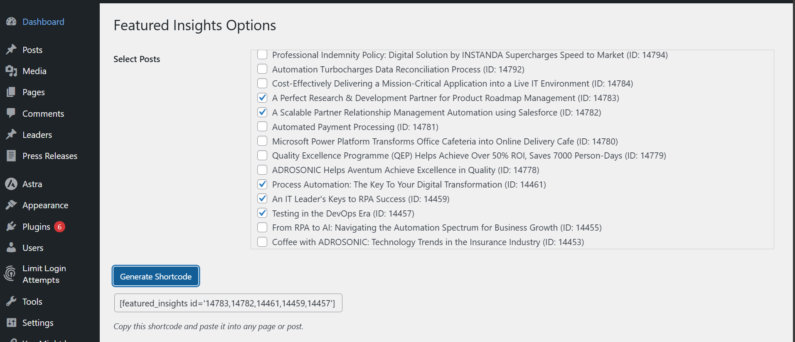

# Featured Insights

**Featured Insights** is a custom WordPress plugin that allows you to showcase selected posts in a carousel format on any page or post using a shortcode. This project demonstrates WordPress plugin development, shortcode usage, and basic UI integration.

---

## **Features**

- Display a carousel of posts on any page or post.
- Select which posts to display via the plugin’s settings page.
- Generate a shortcode with selected post IDs.
- Fully customizable and lightweight.
- Uses OwlSlider for smooth carousel transitions.

---

## **Installation**

1. Clone or download this repository.
2. Copy the `featured-insights` folder to `wp-content/plugins/`.
3. Activate the plugin from the WordPress admin dashboard.
4. Go to the **Featured Insights** menu in WordPress admin to select posts and generate the shortcode.
5. Paste the generated shortcode into any page or post using the WordPress shortcode widget.

---

## **Usage**

1. Open the plugin settings page in WordPress admin.
2. Select one or more posts to include in the carousel.
3. Click **Generate Shortcode**.
4. Copy the generated shortcode.

---

## Screenshots

**Settings Page:**

**Carousel Example:**


```text
[featured_insights id='14123,14127,14130']
